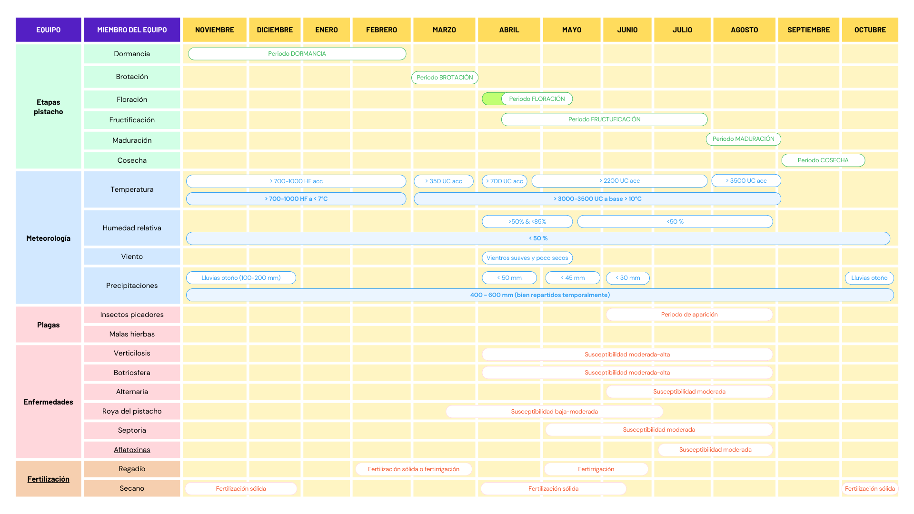

# Modelo conceptual pistacho

## Información disponible

Información disponible por hora:

1. Temperatura (T)
2. Humedad relativa (HR)
3. Viento y dirección vientos dominantes
4. Precipitaciones (PP)
5. Tiempo del año (hora, día, mes)

### Atributos derivados

Tbase es a partir de la cual se cuenta como UC (correspondiente de cada variedad). Fórmula general para las Unidades de Calor (GDD):
$$UC = \frac{T_{máx}+T_{mín}}{2}-UC_{base}$$ <https://semillastodoterreno.com/2018/11/las-unidades-calor>
Donde:

$T_{máx}$ es la temperatura máxima registrada en un día determinado.
$T_{mín}$ es la temperatura mínima registrada en un día determinado.
$UC_{base}$ es la temperatura base, específica de cada especie.

Fórmula para las unidades de calor de Ferguson L.:
$$UC = \frac{T_{MM}+T_{mm}}{2}_183$$ <https://zaguan.unizar.es/record/60565/files/TAZ-TFG-2016-4799_ANE.pdf>
Donde:

$T_{MM}$ es la temperatura media de las máximas registradas (en un día, mes o año)
$T_{mm}$ es la temperatura media registrada (en un día, mes o año)

---

Tbase es a partir de la cual se cuenta como HF (correspondiente de cada variedad) <https://www.vilab.cl/p/horas-frio>
$$HF = hours(T < HFbase)$$

Donde:

T es la temperatura registrada en una hora determinada.
HFbase es la temperatura de frio base, específica de cada especie.

## Modelo conceptual

### Story

### Gantt

## Variedad de pistacho

### Kerman

- Horas de frio: > 1000
- Horas de calor: > 3500
- Vigor (capacidad para soportar los factores estresantes ambientales): medio
- Vecería: muy acusada con 40-80% de frutos abiertos y 15-25% de frutos vacíos dependiendo de las condiciones <https://www.dipujaen.es/export/sites/default/galerias/galeriaDescargas/diputacion/dipujaen/agricultura-medio-ambiente/Folleto_Cultivo_Pistacho.pdf> <https://www.viverovettonia.com/vivero-pistacho-kerman/>
- Entrada en producción: bastante precoz
- Limites de temperaturas: -30°C a 50°C
- Raíces: sensibles a hongos, por eso requieren suelos bien drenados
- Resistencia enfermedades: medio
- Edad árbol: 10 a 30 años (Después de 15-20 años se produce el rendimiento máximo)
- Hora de calor: > 10°C
- Hora de frio: < 7°C
- Plagas a las que es más susceptible: insectos picadores
- Enfermedades a las que es más susceptible: [Botriosfera, Alternaria](https://www.mapa.gob.es/es/agricultura/temas/sanidad-vegetal/guiagippistachoweb_tcm30-444529.pdf)

## Parámetros iniciales iniciales

- Localización -> ["Valladolid", "Valencia", "Zaragoza"]
- Tipo de tiempo -> ["extremo", "moderado", "normal"]
- Tipo de suelo -> [{grado de drenaje: numérico}, {grado de profundidad: categórico}]
- Variedad de pistacho (predisposición a frutos vacíos, cantidad de horas de frío (HF) y calor (HC) necesarias, capacidad de polinización, resistencia a plagas y enfermedades, factor regenerativo, etc)
- Gestión de cultivo (experiencia laboreo, uso bioestimulantes, capacidad actuación frente a plagas, enfermedades y desastres climáticos (inundaciones, fuertes vientos, granizo, etc), etc)
- Grado de automatización (monitorización, previsión de plagas, enfermedades, fenómenos climáticos, etc; )
<!-- - Posicionamiento de los árboles macho (Bien hecho -> dirección vientos dominantes, Mal hecho -> dirección distinta vientos dominantes) -->
- Enfermedades que pueden afectar -> ["Verticillium", "Roya del pistacho", etc]
- Plagas que pueden afectar -> ["Insectos picadores"]
- Portainjerto o planta injertada? -> [{tipo de injerto: categórico}] <https://iberopistacho.com/el-injerto-en-el-pistacho/>

## Enfermedades

| Enfermedad   | Temperatura | Humedad    | Velocidad propagación | Dificultad tratamiento | Afección futura | Notas                                                                       |
| ------------ | ----------- | ---------- | --------------------- | ---------------------- | --------------- | --------------------------------------------------------------------------- |
| Verticillium | 20 a 30°C   | Mejor alta | Lenta                 | Muy alta               | Muy alta        | -                                                                           |
| Botriosfera  | 27 - 33°C   | _> 60%_    | Alta                  | Media                  | Muy alto        | Si la HR alta se intercala con periodos secos, la incidencia es mucho mayor |
| Alternaria   | 27 - 35°C   | _> 70%_    | Media                 | Media                  | Media           | -                                                                           |
| Septoria     | > 10°C      | _> 60%_    | Alta                  | Media                  | Media           | Periodo de incubación se sitúa entre los 10 y 30 días.                      |
| Aflatoxinas  | 27 - 40°C   | _> 60%_    | Alta                  | Muy alta               | Medio           | -                                                                           |

Extraído de <https://www.intagri.com/articulos/fitosanidad/marchitez-del-aguacate-por-verticillium-sp> - Esta información es propiedad intelectual de INTAGRI S.C., Intagri se reserva el derecho de su publicación y reproducción total o parcial.
<https://www.mapa.gob.es/es/agricultura/temas/sanidad-vegetal/guiagippistachoweb_tcm30-444529.pdf>
<https://seguridadalimentaria.elika.eus/fichas-de-peligros/aflatoxinas/>

## Tipos de estrés (<https://symborg.com/es/actualidad/tipos-de-estres-en-plantas-guia-basica-para-agricultores/>)

- Estrés por temperatura: La mayoría de las plantas son sensibles al estrés por temperatura y sufren cuando estas superan los umbrales definidos para cada una de ellas. Las altas temperaturas, por ejemplo, causan daños fisiológicos y metabólicos. Con las bajas, las plantas dejan de crecer o se congelan y terminan muriendo.
- Estrés por falta o exceso de luz: La luz es la fuente de energía para la fotosíntesis, que está relacionada con la producción de carbohidratos y oxígeno. Cada variedad tiene sus propias necesidades de luz y de sol, la falta o el exceso de estos influye también en su crecimiento y desarrollo.
- Estrés por enfermedades y plagas: Las plantas pueden sufrir el ataque de otros organismos perjudiciales que limiten o afecten a su desarrollo y además, la aplicación de tratamientos sintéticos para combatirlos también puede ser muy estresantes según que condiciones se realicen.
- Estrés por la ausencia o exceso de nutrientes: la ausencia de nutrientes afecta al crecimiento de las plantas y a su fruto, pero el exceso también tiene efectos negativos, como en los casos del nitrógeno y del fósforo.
- Estrés salino: Este tipo de estrés se puede producir por el exceso de sal en el suelo o el agua de riego. Una mala gestión del riego también puede incidir en estos problemas de salinidad.
- Estrés hídrico: El estrés hídrico es uno de los más frecuentes y una de las principales causas de muerte en las plantas. Sin agua, se produce un desequilibrio entre la transpiración y la absorción de agua y las plantas no pueden transportar los nutrientes de la raíz a las hojas, viéndose afectados el crecimiento y la producción de los cultivos. Por otro lado, un exceso de agua en el medio puede provocar una serie de perturbaciones que limiten el crecimiento de las plantas debido a la falta de oxígeno.
- Estrés mecánico: Este es el estrés causado por el daño que ocasionan la maquinaria agrícola y otras herramientas utilizadas en las actividades agrícolas, como la poda, el trasplante o el aclareo e inclusive los provocados por condiciones meteorológicas adversas, granizo, viento, etc.

## Modelo basado en estrés

Como hemos visto, tenemos distintos tipos de estrés, que pueden afectar a la planta dependiendo de las condiciones externas que aparezcan, incluyendo meteorología, plagas, enfermedades y los propios agricultores.

El modelo que vamos a implementar es basado en estrés. Es decir, que queremos predecir el estrés que se va a sentir la planta a partir de los distintos tipos de estrés y el conocimiento que hemos recogido sobre las causas y efectos de estos. El estrés no es como un relé, que pasa de 0 a 1 rápidamente, sino que tiene un proceso que puede durar cierto tiempo. No sabemos bien cuánto tiempo tarda, ni que efectos exactos tiene ni como se expande por la planta.

Para esto, los procesos orgánicos no suelen ser lineales, sino que son no lineales. Por ejemplo, cuando una enfermedad se expande, empieza suavemente y tarda su tiempo. Sin embargo, a más pase el tiempo, más rápido se expande y por más sitios, tornándolo un proceso incluso exponencial. Con esta base, vamos a crear las siguientes funciones, que tendrán los siguientes elementos comunes:

- Función exponencial: está entre 0 y 1 y depende del parámetro correspondiente. Por ejemplo, en el caso de estrés por horas de frío, depende de las horas de frío.
- Constante de crecimiento ($\alpha$): regula la velocidad de crecimiento del estrés. Está entre -10 y 10. Cuando se acerca a 0, el estrés se vuelve lineal, cuando se acerca a -10 se vuelve exponencial y cuando se acerca a 10 se vuelve logarítmica.
- Componente aleatorio: que puede ser una distribución normal, por ejemplo, dada su media y desviación estándar o una constante que se elija de forma aleatoria entre un rango de probabilidades.
- Constantes correctoras: son valores que hacen que el estrés se reduzca. Por ejemplo, un vigor alto o un grado de automatización superior en la plantación reducen el estrés.
- Otros estrés que acentúen ese estrés: Ciertos tipos de estrés, cuando llegan a un nivel determinado, pueden provocar y/o acentuar otros tipos de estrés. Por ejemplo, cortar mal las ramas puede provocar heridas (estrés mecánico), que a su vez la hace más susceptible a plagas (estrés por plaga).

<https://www.desmos.com/calculator>

### Fórmulas

#### Estrés por horas de frío

$$
S_{horas\_frio}(HF) = \begin{cases}
    \frac{1 - e^{-\alpha_{frio} |r_{frio}|}}{1 - e^{-\alpha_{frio}}} + \epsilon & HF < HF_{optimo}\\
    0 & HF \ge HF_{optimo}
\end{cases}
$$

$r_{frio} = 0 \ge \frac{HF}{HF_{optimo}} > 1$
$\epsilon = N(μ, σ)\ con\ \mu = 0\ y\ σ = 0.15$

#### Estrés por uds de calor

$$
S_{uds\_calor}(UC) = \begin{cases}
    \frac{1 - e^{-\alpha_{calor} |r_{calor}|}}{1 - e^{-\alpha_{calor}}} + \epsilon & UC < UC_{optimo}\\
    0 & UC \ge UC_{optimo}
\end{cases}\\
$$

$r_{calor} = 0 \ge \frac{UC}{UC_{optimo}} > 1$
$\epsilon = N(μ, σ)\ con\ \mu = 0\ y\ σ = 0.15$

#### Estrés por temperatura

$$
S_{temperatura}(H_{T\_ext}) = \begin{cases}
    S_{temperatura\_0} + \frac{1 - e^{-\alpha_{temp} |r_{temp}|}}{1 - e^{-\alpha_{temp}}} - \sum_{i=1}^{n\_correctores} \beta_{i} + \epsilon & H_{T\_ext} > 0\\
    0 & H_{T\_ext} = 0
\end{cases}\\
siendo\ H_{T\_ext} = hours(T \ge T_{max} ∨ T_{min} \ge T)\\
r = 0 \ge \frac{H_{T\_ext}}{HT_{max}} > 1\ y\ HT_{max} = 730\ horas\ (1\ mes)
$$

$\epsilon = N(μ, σ)\ con\ \mu = 0\ y\ σ = 0.2$
$n_{correctores} =$ {gestion_cultivo}

#### Estrés hídrico

$$
S_{hidrico}(PP) = \begin{cases}
    S_{hidrico\_0} + \frac{1 - e^{-\alpha_{hidrico} |r_{hidrico}|}}{1 - e^{-\alpha_{hidrico}}} - \sum_{i=1}^{n\_correctores} \beta_{i} + \epsilon & PP < PP_{minimo} ∨ PP > PP_{max}\\
    S_{hidrico\_0} & PP_{minimo} \ge PP \ge PP_{max}
\end{cases}
$$

$r_{hidrico} = 0 \ge \frac{PP - PP_{min}}{PP_{max} - PP_{min}} > 1$
$n_{correctores} =$ {gestion_cultivo, tipo_suelo}

#### Estrés mecánico

$$
S_{mecánico} = S_{mecánico\_0} + 1 - M - \sum_{i=1}^{n\_correctores} \beta_{i}
$$

$M = N(μ, σ)\ con\ \mu = 0\ y\ σ = 0.25$
$n_{correctores} =$ {gestion_cultivo, resistencia_variedad, grado_automatizacion}

#### Estrés nutricional

$$
S_{nutricional} = \begin{cases}
 S_{nutricional\_0} + 1 - N + \sum_{i=1}^{n\_estrés} \sigma_{i} \cdot S_{i} - \sum_{i=1}^{n\_correctores} \beta_{i} & fertilización ∧ (S\_{hidrico} > 0.5 ∨ ¬S)\\
 S_{nutricional\_0} & S_{hidrico} \le 0.5 ∧ no\ fertilización
\end{cases}
$$

$N = N(μ, σ)\ con\ μ = 0.5\ y\ σ = 0.25.$
$N$ representa el grado de acierto de fertilización.
$epsilon = N(μ, σ)\ con\ μ = 0\ y\ σ = 0.15.$
$n_{estres} =$ {hidrico}
$n_{correctores} =$ {gestion_cultivo}

#### Estrés por plaga

$$
S_{plaga}(H_{HR\_plaga}, H_{T\_plaga}, mes) = \begin{cases}
    S_{plaga\_0} + \frac{1 - e^{-\alpha_{plaga} |r_{plaga}|}}{1 - e^{-\alpha_{plaga}}} + \sum_{i=1}^{n\_estrés} \sigma_{i} \cdot S_{i} - \sum_{i=1}^{n\_correctores} \beta_{i} + \epsilon & (H_{HR\_plaga} > 0 ∧ H_{T\_plaga} > 0) ∧ (S_{mecánico} > 0.5 ∨ S_{uds\_calor} > 0.25 ∨ ¬S)\\
    S_{plaga\_0} & H_{HR\_plaga} = 0 ∨ H_{T\_plaga} = 0
\end{cases}\\
$$

$n_{estrés} =$ {mecánico, uds_calor}

<!-- $n\_correctores =$ {actuación, resistencia_variedad, tratamiento} -->

$n_{correctores} =$ {gestion*cultivo, vigor}
$H*{HR_plaga} = hours(HR \ge HR*{max})\ y\ H*{T_plaga} = hours(T \ge T*{max})$
$\epsilon = N(μ, σ)\ con\ \mu = 0\ y\ σ = 0.25$
$r*{plaga} = 0 \ge \frac{H*{HR_plaga}}{H*{HR_plaga_max}} \cdot \frac{H*{T_plaga}}{H*{T_plaga_max}} > 1$
$\alpha\_{plaga}$ es la ferocidad de la plaga.

#### Estrés por enfermedad

$$
S_{enfermedad}(H_{HR\_enf}, H_{T\_enf}, mes) = \begin{cases}
    S_{enf\_0} + \frac{1 - e^{-\alpha_{enf} |r_{enf}|}}{1 - e^{-\alpha_{enf}}} + \sum_{i=1}^{n\_estrés} \sigma_{i} \cdot S_{i} - \sum_{i=1}^{n\_correctores} \beta_{i} + \epsilon & (H_{HR\_enf} > 0 ∧ H_{T\_enf} > 0) ∧ (S_{plaga} > 0.4 ∨ S_{nutricional} > 0.5 ∨ S_{mecánico} > 0.5 ∨ S_{uds\_calor} > 0.25 ∨ ¬S)\\
    S_{enf\_0} & H_{HR\_enf} = 0 ∨ H_{T\_enf} = 0
\end{cases}\\
$$

$n_{estrés} =$ {plaga, nutricional, mecánico, uds*calor}
$n*{correctores} =$ {gestion*cultivo, vigor}
$H*{HR_enf} = hours(HR \ge HR*{max})\ y\ H*{T*enf} = hours(T \ge T*{max})$
$\epsilon = N(μ, σ)\ con\ \mu = 0\ y\ σ = 0.25$
$r*{enf} = 0 \ge \frac{H*{HR_enf}}{H*{HR_enf_max}} \cdot \frac{H*{T_enf}}{H*{T_enf_max}} > 1$
$\alpha*{enf}$ es la ferocidad de la enfermedad.

#### Estrés total

Media ponderada de cada uno de los estrés correspondiente. Cada $\lambda$ es la importancia que queremos darle a cada uno de ellos.

$$
S_{total} = \lambda_{prev} \cdot S_{prev} + \frac{\sum_{i=1}^{n_{estrés}} \lambda_{i} \cdot S_{i}}{\sum_{i=1}^{n_{estrés}} \lambda_{i}}
$$

$\lambda_{i}$ es el peso ponderado de cada uno de los estrés.
$n_{estrés} =$ {horas_frio, temperatura, uds_calor, hidrico, mecánico, nutricional, plaga, enfermedad}

#### Producción

$$
P = \gamma_{polinizacion} \cdot (\gamma_{vecería} \cdot (1 - S_{total}) \cdot P_{base} + \gamma_{edad}) + \epsilon\\
$$

$\gamma_{edad}$ representa que cada dos tres años sube 1kg la producción.
$\epsilon = N(\mu, \sigma)\ con\ \mu = 0\ y\ \sigma = 0.20.$
$\gamma_{vecería}$ representa la fuerza de la vecería y depende del año anterior. Entre el 40\%-80\% menos de la producción del año anterior.
$\gamma_{vecería} = Prob(40\%-80\%) \cdot P_{last}$

$\gamma_{polinizacion}$ representa el porcentaje de polinización de los árboles macho a los hembra en el mes de Abril.

$
\gamma_{polinizacion} = \begin{cases}
    1 - \frac{1 - e^{-\alpha_{polinización} |r_{polinización}|}}{1 - e^{-\alpha_{polinización}}} - \lambda \cdot S_{chill\_hours} + \epsilon & avg(HR) > 85\% \vee PP > 50 mm\\
    1 & avg(HR) < 85\% \wedge PP \le 50 mm
\end{cases}
$

$
r_{polinización} = 0 \le \frac{avg(HR) - avg(HR_{min})}{avg(HR_{max}) - avg(HR_{min})} \cdot \frac{PP - PP_{min}}{PP_{max} - PP_{min}} \le 1
$

### Modelo de estrés

Cada estrés tiene un _trigger_ para que aparezca y algunos de ellos pueden acentuarse por otro. Por ejemplo, un déficit en unidades de calor (estrés por uds de calor) puede provocar que haya mayor probabilidad de que haya plagas después, porque la planta no se fortalece lo suficiente. En este caso, lo hemos representado como:

Cuando $S_{uds\_calor} > 0.25$ provoca un estrés por plaga cuando las condiciones sean las adecuadas de forma más acusada.

assdkfajaskdjf

---

